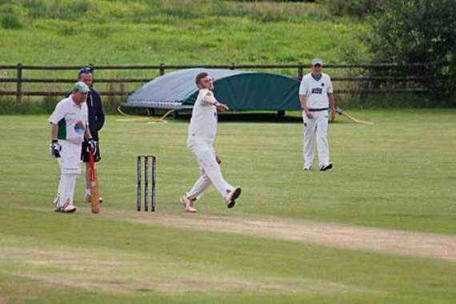
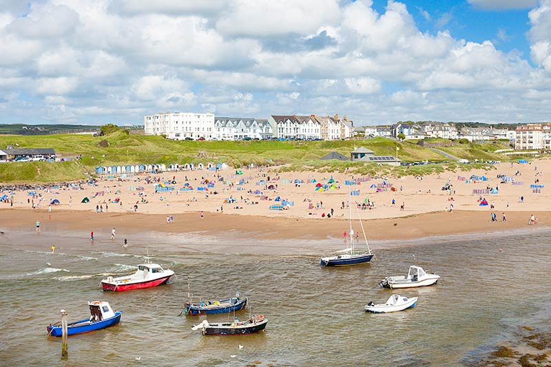

```{r message=FALSE, warning=FALSE, echo = FALSE}
suppressMessages(library("tidyverse"))
library(ggmap)
```

#Road map of Bude 
```{r message=FALSE, warning=FALSE, echo = FALSE}
map_road <- get_googlemap(center = c(-4.543678, 50.826636), zoom = 14, maptype = "roadmap")
ggmap(map_road)
```

#Watercolor map of Bude 
```{r message=FALSE, warning=FALSE, echo = FALSE}
map_watercolor <- get_map(location = c(-4.5413, 50.82435),source="stamen", zoom = 14, maptype = "watercolor")
ggmap(map_watercolor)
```

#Map including marked locations

###Locations: 
- Red: Bude North Cornwall Cricket Club 
- Blue: Summerleaze Beach 
- Green: Crooklets Beach
- Purple (Pub): The Barrel at Bude

#Road map with locations
```{r message=FALSE, warning=FALSE, echo = FALSE}
ggmap(map_road) +
  geom_point(
    aes(x =  -4.552314 , y = 50.835289),
    color = "red", size = 2) +
  geom_point(
    aes(x = -4.551312 , y = 50.83074),
    color = "blue", size = 2) +
  geom_point(
    aes(x = -4.553962 , y = 50.83587),
    color = "green", size = 2) +
  geom_point(
    aes(x = -4.543023, y = 50.830066),
    color = "purple", size = 2)
```

#Watercolor map with locations
```{r message=FALSE, warning=FALSE, echo = FALSE}
ggmap(map_watercolor) +
  geom_point(
    aes(x =  -4.552314 , y = 50.835289),
    color = "red", size = 2) +
  geom_point(
    aes(x = -4.551312 , y = 50.83074),
    color = "blue", size = 2) +
  geom_point(
    aes(x = -4.553962 , y = 50.83587),
    color = "green", size = 2) +
  geom_point(
    aes(x = -4.543023, y = 50.830066),
    color = "purple", size = 2)
```

#Road map from the cricket club to the pub 
```{r message=FALSE, warning=FALSE, echo = FALSE}
from <- "Bude North Cornwall Cricket Club"
to <- "The Barrel at Bude"
route_df <- route(from, to, structure = "route")
ggmap(map_road) + 
  geom_point(aes(x =  -4.552314 , y = 50.835289), color = "red", size = 2) +
  geom_point(aes(x = -4.543023, y = 50.830066), color = "purple", size = 2) +
  geom_path(aes(x = lon, y = lat), colour = "black", size = 1, data = route_df, lineend = "round")
```

#Watercolor map from the cricket club to the pub 
```{r message=FALSE, warning=FALSE, echo = FALSE}
from <- "Bude North Cornwall Cricket Club"
to <- "The Barrel at Bude"
route_df <- route(from, to, structure = "route")
ggmap(map_watercolor) + 
  geom_point(aes(x =  -4.552314 , y = 50.835289), color = "red", size = 2) +
  geom_point(aes(x = -4.543023, y = 50.830066), color = "purple", size = 2) +
  geom_path(aes(x = lon, y = lat), colour = "black", size = 1, data = route_df, lineend = "round")
```


#Images






\newpage

# Added on after fork
# Hotels around Bude

The Budehaven Guesthouse, An Mor, and Sea Jade Guest House


The Budehaven Guesthouse 


One of the most popular hotels around Bude, The Budehaven Guesthouse is a 10 minute walk to numerous beaches in Bude, North Bude golf course, and Bude town center. Featuring barbeque facilities, a bar and a beautiful shared lounge, Budehaven is the top choice among many vacation families, weddings, and parties. 


An Mor 


A small yet popular place to reside in, An mor is a 28-room inn located right next to the Bude beaches. Besides providing comfortable and relaxing resting spaces, this small hotel also provides its special Gin master class, where visitors can taste and experience how Gin is made.


Sea Jade Guest House 


Famous for its slogan "come as guests, leave as friends" and one of the top choices for families for small children, Sea Jade Guest House is a quiet inn located close to many local stores and restaurants, including many local ice-cream stores and boutiques. 


\newpage


# Adding three hotels to the map of Bude
```{r message=FALSE, warning=FALSE, echo = FALSE}
library(ggmap)
library(tidyverse)
hotel <- c("The Budehaven Guesthouse","An Mor","Sea Jade Guest House")
g <- geocode(hotel)
map <- get_map(g)
bb <- attr(map, "bb")
bbox <- bb2bbox(bb)

map_road <- get_map(location=g, maptype = "roadmap",zoom= 16)

map <- ggmap(map_road)+
  geom_point(
    aes(x = lon, y = lat),
    data = g, color = "red", size = 3
  )

map <- map+ annotate("text", x = -4.5435, y = 50.8317, label = "The Budehaven Guesthouse")
map <- map+ annotate("text", x = -4.544, y = 50.8355, label = "An Mor")
map <- map+ annotate("text", x = -4.548, y = 50.8303, label = "Sea Jade Guest House")
map
```


\newpage

# The hotel images 


\newpage


# Citations

http://www.anmorhotel.co.uk/

http://www.thebudehaven.com/

http://www.seajadeguesthouse.co.uk/

