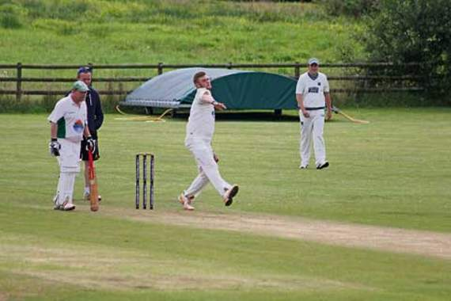
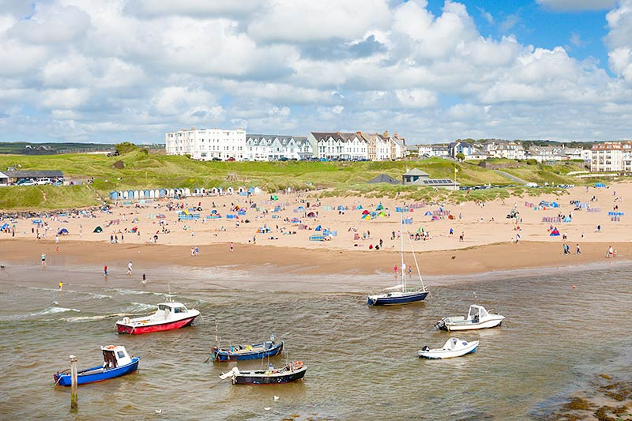
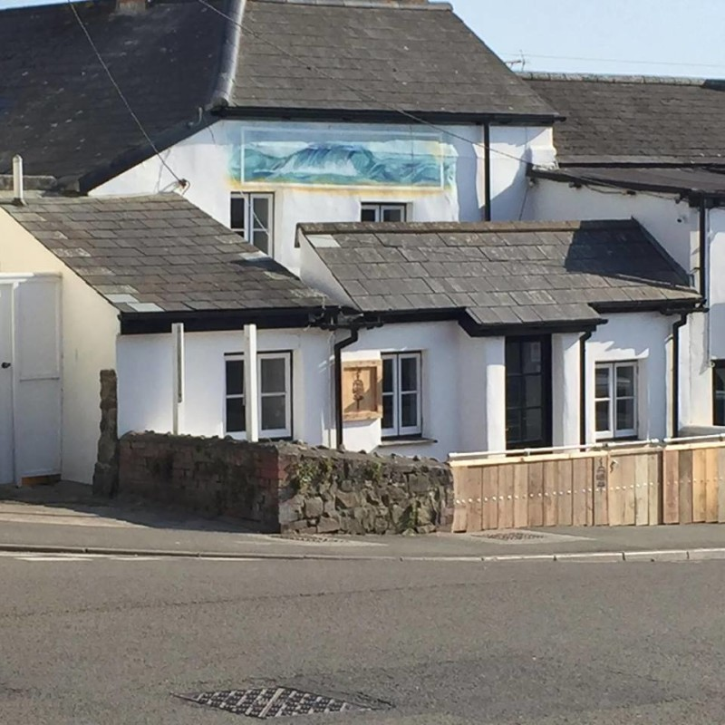

```{r message=FALSE, warning=FALSE, echo = FALSE}
suppressMessages(library("tidyverse"))
library(ggmap)
```

#Road map of Bude 
```{r message=FALSE, warning=FALSE, echo = FALSE}
map_road <- get_googlemap(center = c(-4.543678, 50.826636), zoom = 14, maptype = "roadmap")
ggmap(map_road)
```

#Watercolor map of Bude 
```{r message=FALSE, warning=FALSE, echo = FALSE}
map_watercolor <- get_map(location = c(-4.5413, 50.82435),source="stamen", zoom = 14, maptype = "watercolor")
ggmap(map_watercolor)
```

#Map including marked locations

###Locations: 
- Red: Bude North Cornwall Cricket Club 
- Blue: Summerleaze Beach 
- Green: Crooklets Beach
- Purple (Pub): The Barrel at Bude

#Road map with locations
```{r message=FALSE, warning=FALSE, echo = FALSE}
ggmap(map_road) +
  geom_point(
    aes(x =  -4.552314 , y = 50.835289),
    color = "red", size = 2) +
  geom_point(
    aes(x = -4.551312 , y = 50.83074),
    color = "blue", size = 2) +
  geom_point(
    aes(x = -4.553962 , y = 50.83587),
    color = "green", size = 2) +
  geom_point(
    aes(x = -4.543023, y = 50.830066),
    color = "purple", size = 2)
```

#Watercolor map with locations
```{r message=FALSE, warning=FALSE, echo = FALSE}
ggmap(map_watercolor) +
  geom_point(
    aes(x =  -4.552314 , y = 50.835289),
    color = "red", size = 2) +
  geom_point(
    aes(x = -4.551312 , y = 50.83074),
    color = "blue", size = 2) +
  geom_point(
    aes(x = -4.553962 , y = 50.83587),
    color = "green", size = 2) +
  geom_point(
    aes(x = -4.543023, y = 50.830066),
    color = "purple", size = 2)
```

#Road map from the cricket club to the pub 
```{r message=FALSE, warning=FALSE, echo = FALSE}
from <- "Bude North Cornwall Cricket Club"
to <- "The Barrel at Bude"
route_df <- route(from, to, structure = "route")
ggmap(map_road) + 
  geom_point(aes(x =  -4.552314 , y = 50.835289), color = "red", size = 2) +
  geom_point(aes(x = -4.543023, y = 50.830066), color = "purple", size = 2) +
  geom_path(aes(x = lon, y = lat), colour = "black", size = 1, data = route_df, lineend = "round")
```

#Watercolor map from the cricket club to the pub 
```{r message=FALSE, warning=FALSE, echo = FALSE}
from <- "Bude North Cornwall Cricket Club"
to <- "The Barrel at Bude"
route_df <- route(from, to, structure = "route")
ggmap(map_watercolor) + 
  geom_point(aes(x =  -4.552314 , y = 50.835289), color = "red", size = 2) +
  geom_point(aes(x = -4.543023, y = 50.830066), color = "purple", size = 2) +
  geom_path(aes(x = lon, y = lat), colour = "black", size = 1, data = route_df, lineend = "round")
```


#Images








